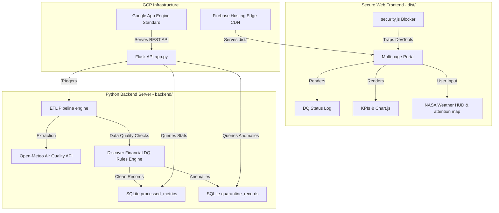

# Enterprise Data Engineering Portfolio & Interactive ETL Sandbox

### 🌐 Live Portfolio URL: [https://archit-de-portfolio-8902.web.app](https://archit-de-portfolio-8902.web.app)

A modern, full-stack multi-page portfolio application showcasing production-grade Data Engineering capabilities, live interactive pipelines, analytics dashboards, system maps, and academic research.

This project is built using a secure frontend design (HTML, CSS, JavaScript) backed by a Python Flask REST API server processing automated data quality rule validations and SQLite data warehousing.

---

## 🏗️ Architecture & Component Flow



---

## 📂 Project Structure

```
data-engineering-portfolio/
│
├── run.bat                            # Double-click local dev server launcher
├── package.json                       # npm task config for production building
├── build.js                           # Node compilation engine (minifies HTML/CSS, obfuscates JS)
├── firebase.json                      # Firebase Hosting configuration (Security HTTP Headers)
├── .firebaserc                        # Firebase environment mapping config
├── netlify.toml                       # Netlify deployment and header config
│
├── backend/                           # Flask API, SQL tables, and ETL processes
│   ├── app.py                         # REST API endpoints (Cache control, environment configs)
│   ├── pipeline.py                    # ETL engine (Extraction, DQ Engine, Transformations, Loading)
│   ├── data.db                        # SQLite local data warehouse
│   ├── app.yaml                       # Google App Engine standard runtime config
│   └── requirements.txt               # Backend Python dependencies
│
└── frontend/                          # Raw visual application source code (development)
    ├── index.html                     # Main portfolio page & credential showcase
    ├── pipeline.html                  # Live console terminal and workflow visualization
    ├── dashboard.html                 # Analytics charts (Chart.js integrations)
    ├── architecture.html              # Interactive system blueprints & latency benchmanks
    ├── xai.html                       # NASA Solar Wind solar storm research playground
    ├── styles.css                     # Custom ambient HSL glassmorphism styling
    ├── security.js                    # Client-side Developer Tools blocking scripts
    ├── menu.js                        # Responsive header mobile menu drawers
    ├── intro.js                       # Landing intro modal controller
    └── Dst_XAI_2024.pdf               # NASA research paper asset
```

---

## ⚡ How to Run the Portfolio Locally (Development Mode)

The project includes a custom launcher script that resolves Python runtimes, installs dependencies, handles port cleansing, and runs both servers simultaneously.

### Step 1: Pre-requisites
Make sure you have [Anaconda/Miniconda](https://www.anaconda.com/) or standard [Python 3.10+](https://www.python.org/) installed on your machine.

### Step 2: Launch the Servers
1. Double-click the **`run.bat`** file in the root folder.
2. The launcher will automatically:
   * Detect your Python installation (prefers conda environment `de_portfolio` or builds a standard virtualenv `.venv` in the workspace).
   * Install necessary Python modules from `backend/requirements.txt`.
   * Clear any legacy processes running on ports `5000` (Flask) and `8000` (HTTP Server).
   * Set `FLASK_ENV=development` in the environment so the backend runs with automatic hot-reloading.
   * Start both backend and frontend servers.
   * Open your default browser to `http://localhost:8000`.

---

## 🔒 Production Build & Inspect Protection (Obfuscation)

To prevent users from viewing, copying, or reverse-engineering your frontend files via **Right-Click -> Inspect Element** or browser **Developer Tools**, you compile the project into a secure, production-ready `dist/` directory before deploying:

### Compile the Production Directory
1. Open your terminal in the root folder and install the build tools:
   ```bash
   npm install
   ```
2. Build the secure package:
   ```bash
   npm run build
   ```
3. This creates a new **`dist/`** directory. All code inside this directory has the following defenses applied:
   * **Minification**: Strips comments and whitespaces from HTML and CSS.
   * **Obfuscation**: Scrambles all JavaScript files (variables renamed to hex values, loops restructured, strings encrypted).
   * **Self-Defending Lock**: The JavaScript files will automatically crash the browser page if anyone attempts to pretty-print, format, or modify the code.
   * **Console Silencing**: Silences all console outputs in production.
   * **Inspect Hotkey Blockers**: Disables right-clicks and blocks shortcut triggers (`F12`, `Ctrl+Shift+I`, `Ctrl+Shift+J`, `Ctrl+Shift+C`, `Ctrl+U`).
   * **Active Debugger Trap**: Periodically runs an active debugger statement. If an engineer manages to open DevTools, the page immediately hits a debugger break statement, freezing their browser inspector entirely.

---

## ☁️ Google Cloud Platform (GCP) Deployment

For public deployment, GCP hosts the secure frontend (`dist/` folder) and backend API separately:

### Step 1: GCP Pre-requisites
1. Install the [Google Cloud SDK (gcloud CLI)](https://cloud.google.com/sdk/docs/install).
2. Install the [Firebase CLI](https://firebase.google.com/docs/cli) globally:
   ```bash
   npm install -g firebase-tools
   ```
3. Log in to your Google Cloud account:
   ```bash
   gcloud auth login
   ```
4. Log in to your Firebase account:
   ```bash
   firebase login
   ```

### Step 2: Create a GCP Project
1. Create a new project (replace `my-portfolio-project-id` with a unique ID):
   ```bash
   gcloud projects create my-portfolio-project-id --set-as-default
   ```
2. Enable App Engine standard in your project (choose a region near you):
   ```bash
   gcloud app create --region=us-central
   ```

### Step 3: Deploy Backend API (Google App Engine)
1. Open `backend/app.yaml` and edit the `ALLOWED_ORIGIN` environment variable to match your project's upcoming Firebase Hosting URL:
   ```yaml
   env_variables:
     FLASK_ENV: "production"
     ALLOWED_ORIGIN: "https://my-portfolio-project-id.web.app"
   ```
2. Deploy the Flask API from the root directory:
   ```bash
   gcloud app deploy backend/app.yaml
   ```
3. Copy the target URL generated (e.g., `https://my-portfolio-project-id.ue.r.appspot.com`). You will update the API base URL in your frontend script files to point to this URL.

### Step 4: Deploy Frontend (Firebase Hosting CDN)
1. Make sure you build the production files:
   ```bash
   npm run build
   ```
2. Link Firebase Tools to your GCP project:
   ```bash
   firebase use --add my-portfolio-project-id
   ```
3. Deploy the frontend:
   ```bash
   firebase deploy --only hosting
   ```
4. The frontend is now live on `https://my-portfolio-project-id.web.app` with full SSL certificates, edge CDN caching, and custom HTTP security headers.

---

## 🐙 How to Upload to GitHub

Follow these steps to store your portfolio source code on GitHub:

1. Log in to [GitHub](https://github.com/) and create a new, empty repository named `data-engineering-portfolio` (do **not** initialize it with a README, license, or `.gitignore` since they are already preconfigured in this directory).
2. Copy your repository URL (e.g., `https://github.com/username/data-engineering-portfolio.git`).
3. Open your terminal in this workspace folder and run:
   ```bash
   # Add your GitHub repository as the remote origin
   git remote add origin https://github.com/username/data-engineering-portfolio.git

   # Rename the default branch to main
   git branch -M main

   # Push your code to GitHub
   git push -u origin main
   ```
4. On future edits, you can push changes to GitHub by running:
   ```bash
   git add .
   git commit -m "Update portfolio assets"
   git push
   ```
