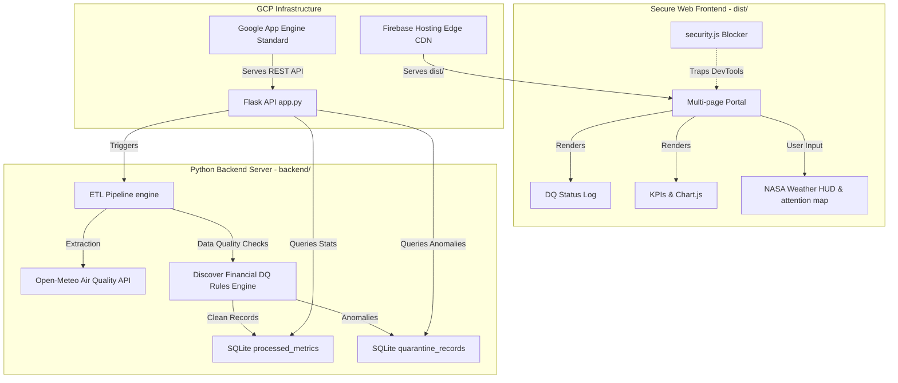

# Enterprise Data Engineering Portfolio & Interactive ETL Sandbox

A modern, full-stack multi-page portfolio application showcasing production-grade Data Engineering capabilities, live interactive pipelines, analytics dashboards, system maps, and academic research.

This project is built using a secure frontend design (HTML, CSS, JavaScript) backed by a Python Flask REST API server processing automated data quality rule validations and SQLite data warehousing.

---

## 🏗️ Architecture & Component Flow



---

## 📂 Project Structure

```
data-engineering-portfolio/
│
├── run.bat                            # Double-click local dev server launcher
├── package.json                       # npm task config for production building
├── build.js                           # Node compilation engine (minifies HTML/CSS, obfuscates JS)
├── firebase.json                      # Firebase Hosting configuration (Security HTTP Headers)
├── .firebaserc                        # Firebase environment mapping config
├── netlify.toml                       # Netlify deployment and header config
│
├── backend/                           # Flask API, SQL tables, and ETL processes
│   ├── app.py                         # REST API endpoints (Cache control, environment configs)
│   ├── pipeline.py                    # ETL engine (Extraction, DQ Engine, Transformations, Loading)
│   ├── data.db                        # SQLite local data warehouse
│   ├── app.yaml                       # Google App Engine standard runtime config
│   └── requirements.txt               # Backend Python dependencies
│
└── frontend/                          # Raw visual application source code (development)
    ├── index.html                     # Main portfolio page & credential showcase
    ├── pipeline.html                  # Live console terminal and workflow visualization
    ├── dashboard.html                 # Analytics charts (Chart.js integrations)
    ├── architecture.html              # Interactive system blueprints & latency benchmanks
    ├── xai.html                       # NASA Solar Wind solar storm research playground
    ├── styles.css                     # Custom ambient HSL glassmorphism styling
    ├── security.js                    # Client-side Developer Tools blocking scripts
    ├── menu.js                        # Responsive header mobile menu drawers
    ├── intro.js                       # Landing intro modal controller
    └── Dst_XAI_2024.pdf               # NASA research paper asset
```

---

## ⚡ How to Run the Portfolio Locally (Development Mode)

The project includes a custom launcher script that resolves Python runtimes, installs dependencies, handles port cleansing, and runs both servers simultaneously.

### Step 1: Pre-requisites
Make sure you have [Anaconda/Miniconda](https://www.anaconda.com/) or standard [Python 3.10+](https://www.python.org/) installed on your machine.

### Step 2: Launch the Servers
1. Double-click the **`run.bat`** file in the root folder.
2. The launcher will automatically:
   * Detect your Python installation (prefers conda environment `de_portfolio` or builds a standard virtualenv `.venv` in the workspace).
   * Install necessary Python modules from `backend/requirements.txt`.
   * Clear any legacy processes running on ports `5000` (Flask) and `8000` (HTTP Server).
   * Set `FLASK_ENV=development` in the environment so the backend runs with automatic hot-reloading.
   * Start both backend and frontend servers.
   * Open your default browser to `http://localhost:8000`.

---
